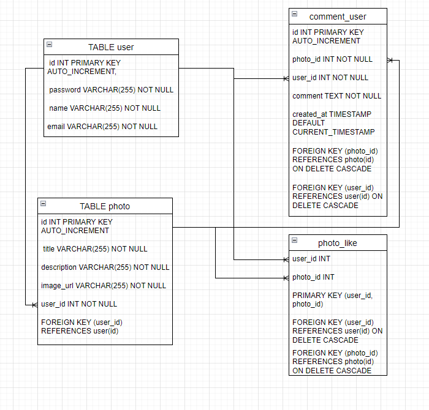
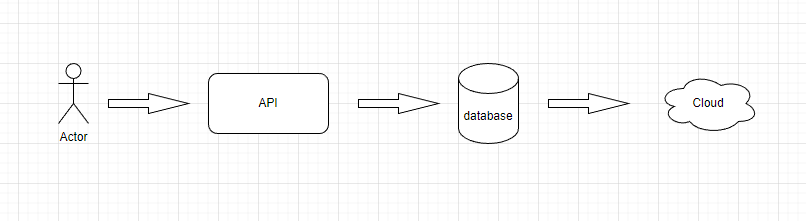

# Photo_Sharing_Application
Membuat suatu aplikasi yang dirancang untuk berbagi dan menyimpan foto. Aplikasi semacam ini biasanya memungkinkan pengguna untuk mengunggah foto, melihat foto yang diunggah oleh pengguna lain, memberikan komentar pada foto, dan melakukan interaksi sosial lainnya terkait foto.

## Architecture Diagram



## Database models



## Run Locally

Go to the project directory

```bash
  cd my-project
```

Install dependencies

```bash
  npm install
```

Start the server

```bash
  npm run start
```


## Demo

Insert gif or link to demo

http://localhost:5000

## Library/Framework
    "basic-auth": "^2.0.1",
    "body-parser": "^1.20.2",
    "crypto": "^1.0.1",
    "express": "^4.18.2",
    "mysql2": "^3.3.0",
    "nodemon": "^2.0.22"
  
## API Endpoint


| Methods | Endpoints     | Description                |
| :-------- | :------- | :------------------------- |
| `post` | `user/register` | membuat akun |
| `get` | `user/data` | mendapatkan semua data akun yang terdaftar |
| `delete` | `user/delete-account` | menghapus akun yang sudah terbuat |
| `post` | `user/photo` | post photo |
| `put` | `user/photo/:id` | mengubah title dan description pada photo |
| `post` | `user/like-photo/:id` | like photo |
| `delete` | `user/photo/:photoId/like` | menghapus like pada photo |
| `post` | `user/photo/:photoId/comment` | post komentar pada sebuah foto |
| `put` | `user/photo/:photoId/comment/:commentId` | update komentar pada sebuah foto |
| `delete` | `user/photo/:photoId/comment/:commentId` | delete komentar pada sebuah foto |
| `delete` | `user/photo/:id` | menghapus foto |